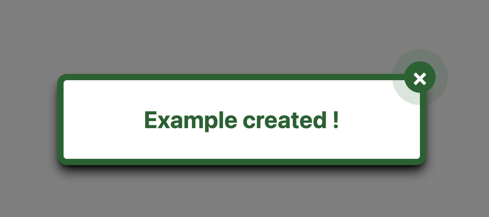

# my-react-modal-sv

This component library is Displays a modal in the center of the screen with a customizable message.

## How to install the Modal

The package can be installed via npm

```bash
npm i my-react-modal-sv
```

## Usage

Import the Modal component from the library:

```bash
import Modal from "my-react-modal-sv";
```

Import CSS (tailwind)

```bash
import 'my-react-modal-sv/dist/style.css';
```

The Modal component needs 3 props :

-   {isOpen} : A property that indicates whether the modal is displayed.
-   {onClose} : A callback function to close the modal.
-   {children} : The content displayed within the modal.

Here's an example:

```jsx
import { useState } from "react";
import Modal from "my-react-modal-sv";
import "my-react-modal-sv/dist/style.css";

function Example() {
    const [isModalOpen, setIsModalOpen] = useState(false);

    const openModal = () => {
        setIsModalOpen(true);
    };

    const closeModal = () => {
        setIsModalOpen(false);
    };
    const handleSubmit = (e) => {
        e.preventDefault();
        openModal();
    };

    return (
        <div>
            <form onSubmit={handleSubmit}>
                <button
                    type="submit"
                    className="fixed top-1/3 left-1/2 transform -translate-x-1/2 -translate-y-1/2 rounded border-solid border-2 border-custom-505 font-bold p-3">
                    Submit Form
                </button>
            </form>

            <Modal isOpen={isModalOpen} onClose={closeModal}>
                <h1>Employee created !</h1>
            </Modal>
        </div>
    );
}

export default Example;
```

## Interface


